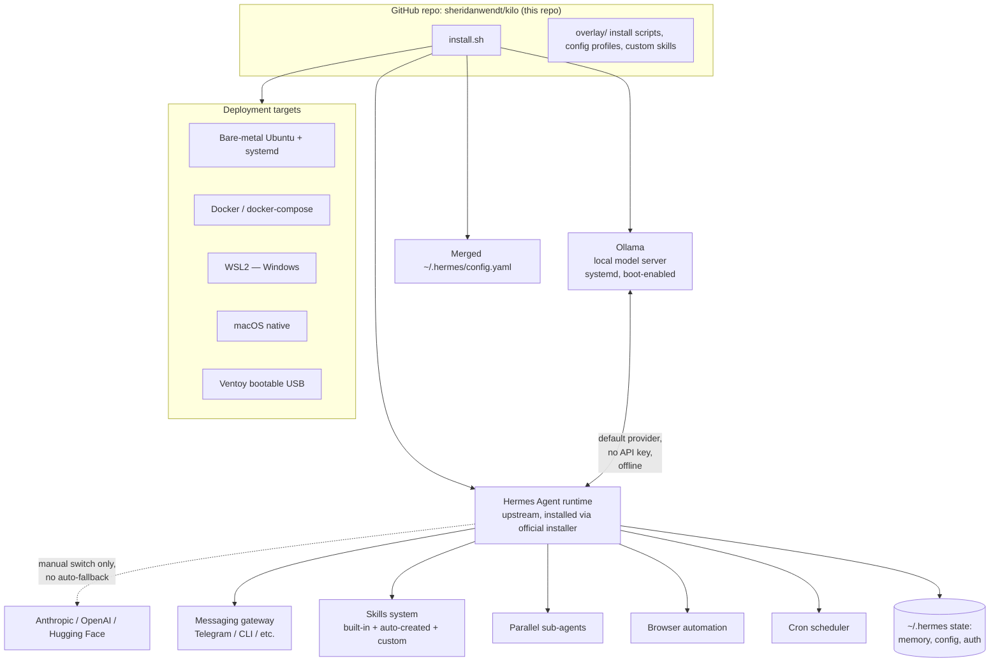

# Hermes Personal Assistant ("kilo")

A self-hosted, local-first, offline-capable personal AI agent built on top of
[Hermes Agent](https://github.com/NousResearch/hermes-agent) (NousResearch,
MIT license, released February 2026). This repository is the **overlay
layer**: install automation, config profiles, and custom skills that turn
stock Hermes Agent into a specific, opinionated personal-assistant
deployment — not a fork of Hermes's source code.

**This file is the entry point. For everything else, see the doc map at the
bottom.** If you are a Claude Code instance picking this project up fresh,
read `CLAUDE.md` next, then `docs/current-state.md`.

## Project purpose

The owner (Sheridan) wants one personal agent that:

1. Runs entirely on hardware they control (laptop, home server, VPS, or a
   bootable USB stick), not a SaaS subscription.
2. Defaults to a **free, offline, local LLM** (via Ollama) for every task,
   and only touches a paid cloud model (Anthropic, OpenAI, or Hugging Face)
   when the owner explicitly switches to one for a specific task — never
   automatically.
3. Starts itself automatically at boot with no manual intervention, already
   pointed at the local model.
4. Can be torn down and rebuilt from scratch, identically, on any of several
   target environments (bare-metal Ubuntu, Docker/cloud VPS, WSL2, macOS, or
   a bootable USB) using a single command.
5. Can perform real work autonomously: browsing the web, running multi-step
   workflows, spawning sub-agents for parallel work, and writing its own new
   skills as it learns to do things.
6. Explicitly does **not** yet make purchases on the owner's behalf — that
   capability is reserved in the architecture but intentionally unbuilt
   until a deliberate, separate decision is made about approval limits.

## Why Hermes Agent

Hermes Agent was evaluated against every requirement above (see
`docs/decisions.md`, ADR-0001) and satisfies nearly all of them natively:
persistent memory, automatic + manual skill authoring, parallel sub-agent
orchestration, built-in browser automation, a cron scheduler, a
multi-platform messaging gateway, and — critically — first-class *native*
support for local Ollama, Anthropic, OpenAI, and Hugging Face as
interchangeable model providers with no proxy service required. The gaps
(purchasing, bootable-USB imaging, "new instance" provisioning with a human
gate) are closed with a thin custom layer documented here, not by building a
new agent framework.

## Vision

A single agent identity ("the assistant") that the owner can stand up on any
machine they own in minutes, that costs nothing to run day-to-day, that gets
smarter over time via its own skill-writing loop, and that never spends
money or touches sensitive external systems without an explicit, in-the-moment
human decision. Multiple physical instances (a home server, a laptop, a
travel USB) are expected to exist eventually; each is provisioned through the
same reviewed, human-gated process rather than organically diverging.

## Major capabilities

| Capability | Status | Mechanism |
|---|---|---|
| Perform tasks / general agentic execution | Native to Hermes | Core agent loop |
| Call other agents / parallel workflows | Native to Hermes | Parallel sub-agents over RPC |
| Create workflows | Native to Hermes | Skills + cron scheduler + sub-agent pipelines |
| Browse the internet | Native to Hermes | Built-in browser automation (nav/click/type/screenshot), web search/extract |
| Add new skills | Native to Hermes | Auto-skill-creation loop + manual `SKILL.md` + agentskills.io hub |
| Offline local LLM, free by default | Native to Hermes, configured by this repo | Ollama via Custom Endpoint (`http://localhost:11434/v1`) |
| Cloud LLM by manual approval only | Native to Hermes, configured by this repo | Anthropic/OpenAI/Hugging Face configured inactive; switched via `hermes model` / `/model`; **no `fallback_providers:` auto-routing** |
| Starts automatically at boot | Native to Hermes + this repo's install scripts | systemd (`hermes-gateway`, `ollama`), ordered |
| Reinstall from scratch, one command | This repo | `install.sh` |
| Bootable, device-agnostic USB | This repo (not yet built) | Ventoy + persistent Ubuntu image |
| New instance creation, human-in-the-loop | This repo (not yet built) | Planned `instance-provision` skill |
| Make purchases | **Deferred, not built** | Reserved architecture slot only — see ADR-0002 |

## High-level architecture



Full detail: `docs/architecture.md`. Decision rationale for every box on
this diagram: `docs/decisions.md`.

## Current state (short version)

Steps 1-3 of the 21-step project plan are done: the repo scaffold exists,
config profiles are defined, and `install.sh` is written. A subsequent
production-readiness audit (`docs/decisions.md` ADR-0012) found and fixed
four real defects that would have broken a fresh-Ubuntu install (missing
baseline packages, a pip version incompatibility, and a `sudo`/PATH bug
that would have made the boot-time service silently read the wrong config)
— `install.sh` is now five steps instead of four. **Still, nothing has been
executed on real hardware yet** — no step from 4 onward in `PROJECT_PLAN.md`
has been validated, and this audit found logic bugs, not the separate
category of unconfirmed config-schema assumptions. Several config keys
(`gateway.platforms`, the exact `model:` schema, a docker-compose env var)
remain best-effort based on documentation research, not confirmed against a
live `hermes model` / `hermes gateway setup` run, and are flagged inline
with `TODO` comments. Full detail: `docs/current-state.md` and
`docs/open-questions.md`.

## Next milestones

1. Run `./install.sh --profile on-prem` on a real Ubuntu box and fix
   whatever the unconfirmed config schema gets wrong (Phase 1 of
   `docs/implementation-plan.md`).
2. Validate the local-first / manual-cloud-switch provider policy actually
   behaves as designed (no silent cloud fallback).
3. Validate boot autostart survives a real reboot, offline.
4. Build the two starter custom skills (`instance-health`,
   `instance-provision`).
5. Only after the on-prem path is solid: Docker path, USB image, multi-OS
   testing (Phases 2-4).

## Quick start

```bash
git clone https://github.com/sheridanwendt/kilo.git
cd kilo
./install.sh --profile on-prem
```

See `overlay/config-profiles/` for the other profiles (`cloud-server`,
`usb-offline`), and `PROJECT_PLAN.md` for the full, checkable task list.

## Doc map

| File | Purpose |
|---|---|
| `CLAUDE.md` | Persistent instructions for any Claude instance working on this repo — read this before writing code. |
| `ARCHITECTURE.md` | Original reference architecture write-up (provider policy, boot autostart, repo layout diagram). |
| `PROJECT_PLAN.md` | 21-step checklist, meant to be checked off as work completes. |
| `docs/architecture.md` | Deeper system architecture: components, data flow, layer boundaries, Mermaid diagrams. |
| `docs/decisions.md` | ADR log — every major decision, alternatives considered, why, consequences. |
| `docs/implementation-plan.md` | The 21 steps grouped into phases with dependencies, risks, complexity. |
| `docs/current-state.md` | What's built, what's stubbed, what's untested, known debt. |
| `docs/api-spec.md` | Contracts for `install.sh`, overlay scripts, and the `config.yaml` schema. |
| `docs/data-model.md` | `~/.hermes` state, config schema, memory layers, backup format. |
| `docs/file-structure.md` | Repo layout and what goes where. |
| `docs/testing.md` | Testing philosophy and what "done" means for each plan step. |
| `docs/security.md` | Threat model, secrets handling, purchase-deferral rationale. |
| `docs/backlog.md` | Prioritized remaining work with acceptance criteria. |
| `docs/open-questions.md` | Everything not yet confirmed against a real H