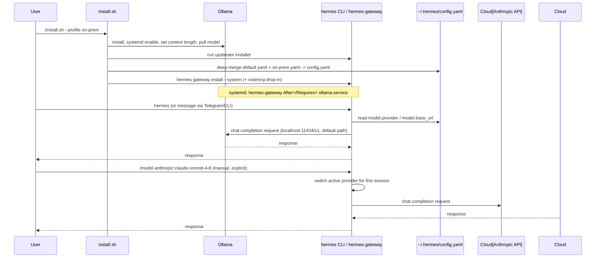
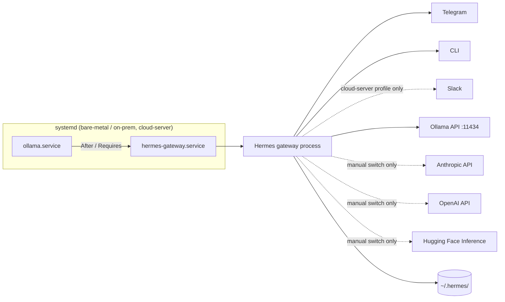
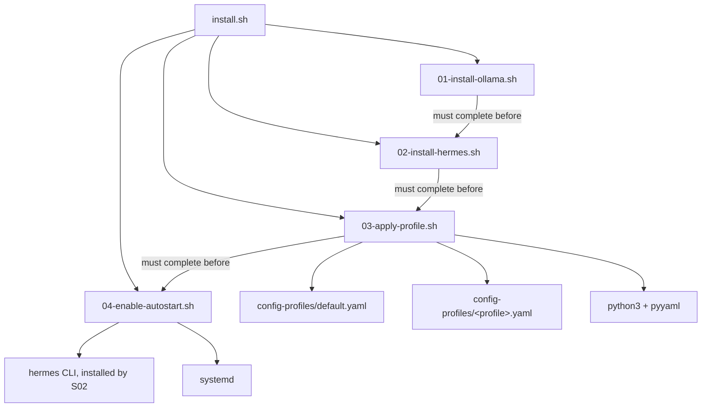

# System architecture

This document describes how the pieces fit together in more detail than
`ARCHITECTURE.md` (the original reference-architecture write-up) or the
README's summary diagram. Read `docs/decisions.md` alongside this for *why*
each piece looks the way it does.

## Component responsibilities

| Component | Owned by | Responsibility |
|---|---|---|
| `install.sh` | this repo | Single entrypoint. Parses `--profile`/`--update`/`--skip-autostart`, calls the four numbered install scripts in order. |
| `overlay/install/01-install-ollama.sh` | this repo | Installs Ollama, enables it as a boot-time systemd service, overrides its context length, pulls the default local model. |
| `overlay/install/02-install-hermes.sh` | this repo, wraps upstream | Runs upstream's official curl installer (or `hermes update` in update mode). |
| `overlay/install/03-apply-profile.sh` | this repo | Deep-merges `default.yaml` with the selected profile YAML, writes `~/.hermes/config.yaml`, backs up any prior config. |
| `overlay/install/04-enable-autostart.sh` | this repo | Registers `hermes-gateway` as a system-level systemd service, adds a drop-in so it starts after `ollama.service`. |
| Hermes Agent runtime | upstream (NousResearch) | Everything at runtime: the agent loop, LLM provider abstraction, skills system, sub-agent orchestration, browser automation, cron scheduler, messaging gateway, memory. This repo does not reimplement any of it. |
| `overlay/config-profiles/*.yaml` | this repo | Declarative, per-target configuration. Not code. |
| `overlay/skills/custom/*` | this repo (content), Hermes (execution) | Custom `SKILL.md` files this repo's owner wants beyond Hermes's 40+ built-ins. |
| `~/.hermes/` | Hermes, on the target machine | All runtime state: config, memory (skill/conversation/user-model), auth tokens for any cloud providers you've connected. Not part of this repo; excluded via `.gitignore`. |

## Data flow



The key property in this diagram: the *only* path from Hermes to a cloud
provider is the explicit `/model` or `hermes model` command from the user.
There is no arrow from Hermes to a cloud provider that doesn't originate
from a manual user action — that's a direct architectural expression of
ADR-0005 (local-first, cloud-by-approval).

## Service interactions (deployed state)



For the Docker deployment target (`cloud-server` profile, optional), the
same relationship is expressed as container `depends_on` plus an internal
Docker network instead of systemd ordering — see
`overlay/docker/docker-compose.override.yml`. Note: the exact mechanism by
which the Hermes container is told to use the sibling Ollama container
instead of `localhost` is flagged unconfirmed — see `docs/open-questions.md`.

## State management

All persistent state lives in `~/.hermes/` on whichever machine Hermes runs
on:

- `~/.hermes/config.yaml` — provider config, gateway config. Owned by this
  repo's install pipeline (generated by `03-apply-profile.sh`), but can also
  be modified live by `hermes model` / `hermes gateway setup` wizards.
  **This means the file can drift from what this repo would generate** —
  re-running `install.sh --update` re-applies the profile and will
  overwrite manual wizard changes (a backup of the prior file is made
  automatically, timestamped, before overwrite).
- `~/.hermes/.env` — cloud provider credentials (`ANTHROPIC_API_KEY`,
  `OPENAI_API_KEY`, `HF_TOKEN`, etc.). Populated manually by the operator,
  not by this repo's scripts. Never committed (`.gitignore`).
- `~/.hermes/auth.json` / `~/.hermes/auth/` — OAuth tokens for providers
  authenticated via `hermes model`'s OAuth flows (Anthropic Max, OpenAI
  Codex, Google Gemini CLI, MiniMax, etc.).
- `~/.hermes/` skill memory, conversation memory, user model — Hermes's own
  three-layer memory system, opaque to this repo.
- `overlay/UPSTREAM_VERSION` — not runtime state, just a documentation
  marker of which upstream version this overlay was last validated against.
  Not enforced (see ADR-0003).

No database, no external state store. Backup/restore is a tarball of
`~/.hermes/` (`docs/data-model.md`, `overlay/docs/runbook.md`).

## Dependency relationships



Ordering is enforced by `install.sh` calling scripts sequentially (not
parallelized) — deliberate, since each stage depends on the previous one
having completed (e.g., you can't apply a profile before Hermes is
installed, and you can't register autostart before the profile is applied).

## Design patterns

- **Overlay / composition, not inheritance or forking.** This repo composes
  with upstream Hermes via its public CLI/installer surface rather than
  extending its source. See ADR-0003.
- **Config-driven variation.** New deployment targets are new YAML files,
  not new code paths. See CLAUDE.md "Architectural principles."
- **Explicit human gate as the security boundary**, not a technical
  permission system. The manual `/model` switch and the (future)
  `instance-provision` confirmation step are the two places this pattern
  appears. There is deliberately no "auto-approve under $X" logic anywhere
  in this repo (contrast with the *rejected* "pre-approved rules + spend
  cap" option for purchasing — ADR-0002).
- **Idempotent install scripts.** Every script in `overlay/install/` checks
  for existing state before acting (e.g., `01-install-ollama.sh` checks
  `command -v ollama` first). This makes `./install.sh` safe to re-run,
  which is required for the "reinstall from scratch" goal to also cover
  "repair a partially-broken install."

## Layer boundaries

```
┌─────────────────────────────────────────────┐
│ This repo (kilo)                             │  <- config, install automation, custom skills
├─────────────────────────────────────────────┤
│ Hermes Agent (upstream, installed not vendored) │  <- agent runtime, providers, skills engine, gateway
├─────────────────────────────────────────────┤
│ Ollama / cloud provider APIs                 │  <- inference backends
├─────────────────────────────────────────────┤
│ OS (Ubuntu / macOS / WSL2) + systemd         │  <- process supervision, boot
├─────────────────────────────────────────────┤
│ Hardware (bare metal / VM / USB-booted)      │  <- physical or virtual target
└─────────────────────────────────────────────┘
```

This repo should never reach *below* the OS layer (no custom kernel modules,
no direct hardware access) or *into* the Hermes Agent layer (no patching
upstream source in place — if upstream is missing something, that's either
a config problem to solve at this repo's layer, a skill to write, or an
upstream feature request, not a fork-and-patch situation).

## Scalability considerations

This is a single-user, single-instance-per-machine personal assistant, not a
multi-tenant service. "Scalability" here means:

- **Multiple independent instances** (home server + laptop + USB), each
  provisioned the same way, not a shared backend — there is no
  synchronization between instances' `~/.hermes/` state as of this handoff
  (see `docs/future-ideas.md` for a possible future memory-sync feature,
  explicitly not in scope now).
- **Model size vs. hardware**: profiles allow overriding `HPA_LOCAL_MODEL`
  per target so a weak USB host isn't forced to run the same model size as a
  beefy home server. This is the primary scaling lever in this system.
- **Sub-agent parallelism** is handled entirely inside Hermes (RPC-based
  isolated sub-agents) — this repo does not manage concurrency or
  scheduling of that.

## Security architecture

Covered in full in `docs/security.md`. Summary of the architectural
elements: no automatic cloud spend (provider policy), no stored payment
credentials (purchase deferral), secrets excluded from git via
`.gitignore`, and a documented precedent for how a GitHub PAT should be
handled if an agent session ever needs one again (scoped, short-lived,
stripped from local config immediately after use, never written to a synced
output location).

## Deployment assumptions

- Target OS is Ubuntu (Server preferred for `on-prem`/`cloud-server`,
  Desktop acceptable for `usb-offline` — see ADR-0006) for the primary
  path; macOS and WSL2 are secondary, explicitly tested later in the plan
  (Phase 3); native Windows is out of scope (ADR-0007).
  - "Ubuntu" throughout defaults to 22.04+ (matches upstream Hermes's own
    stated support baseline); no lower version has been tested.
- The operator has `sudo` access on the target machine — required by
  `01-install-ollama.sh` (systemd enable) and `04-enable-autostart.sh`
  (`hermes gateway install --system`).
- Internet access is required once, at install time (cloning this repo,
  downloading Ollama, pulling the model, running Hermes's installer).
  After that, the `on-prem`/`usb-offline` profiles are designed to function
  fully offline.
- Only one Hermes instance is expected to run per machine/profile at a
  time — no multi-instance-per-host design has been considered.
