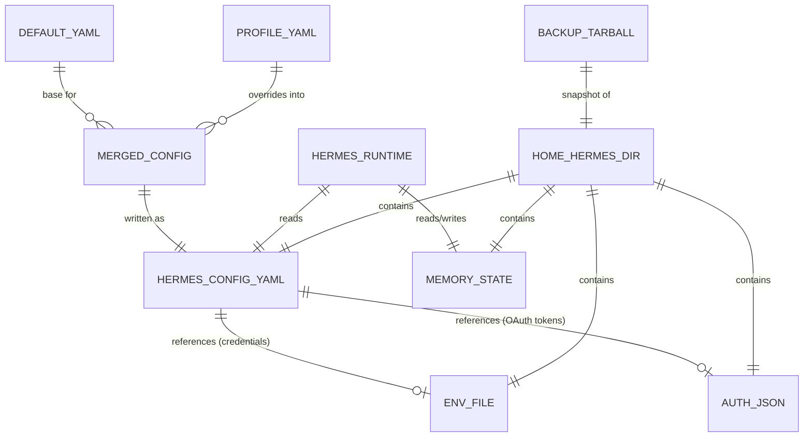

# Data model

This project has no application database. "Data" here means: the
`~/.hermes/` state directory Hermes maintains on each machine, the
config-profile YAML files this repo maintains, and the backup/restore
artifact format. Documented together since they're small and tightly
related.

## Entities

### `~/.hermes/config.yaml`

The merged, active configuration for a given machine. Produced by
`overlay/install/03-apply-profile.sh` (deep-merge of `default.yaml` +
profile override), but can also be modified live by Hermes's own
`hermes model` / `hermes gateway setup` wizards — meaning **this file has
two possible writers** (this repo's install pipeline, and Hermes's own
interactive wizards), which is why `03-apply-profile.sh` backs up the
existing file before overwriting rather than assuming it's always safe to
clobber.

Known/assumed top-level keys (see `docs/api-spec.md` for confirmed vs.
unconfirmed status of each):
- `model` — active provider/model selection.
- `custom_providers` — named custom endpoints (not currently used by this
  repo's profiles; local Ollama is configured inline under `model`
  instead — this asymmetry is flagged in `docs/open-questions.md`).
- `gateway` — messaging platform selection (placeholder schema).
- `fallback_providers` — **must never appear pointing at a cloud
  provider** (ADR-0005). Absent entirely in this repo's current config.
- `auxiliary` — per-task model routing overrides (not currently set by
  this repo; defaults to `"auto"` upstream).

### `~/.hermes/.env`

Cloud provider credentials as environment-variable-style key=value pairs:
`ANTHROPIC_API_KEY`, `OPENAI_API_KEY`, `HF_TOKEN`, and potentially others if
more providers are added later. **Never populated by this repo's scripts**
— the operator sets these manually, which is itself part of the
manual-approval philosophy (ADR-0005): even *configuring* cloud access is a
deliberate human action, not an automated install step.

### `~/.hermes/auth.json` / `~/.hermes/auth/*`

OAuth token storage for providers authenticated via `hermes model`'s OAuth
flows (Anthropic Max/OAuth, OpenAI Codex device-code, Google Gemini CLI
PKCE, MiniMax OAuth, etc.). Structure is entirely upstream Hermes's
concern; this repo never reads or writes these files directly.

### Hermes's three-layer memory (skill / conversational / user-model)

Referenced in `README.md`'s capability description but entirely opaque to
this repo — no schema is documented here because this repo has no need to
parse or manipulate it directly. Treated as an atomic blob for
backup/restore purposes (see below).

### `overlay/config-profiles/*.yaml` (this repo's own data)

Four files: `default.yaml` (base) and one override file per profile
(`on-prem.yaml`, `cloud-server.yaml`, `usb-offline.yaml`). Relationship is
a simple two-level deep merge — `default.yaml` is always applied first, the
selected profile's file is merged on top, profile values win on conflict
(dict-level recursive merge; see `03-apply-profile.sh`'s `deep_merge`
function for exact semantics — non-dict values are replaced wholesale, not
merged, e.g. a list in the profile file fully replaces a list of the same
key name in `default.yaml`, it does not concatenate).

There is currently no third level (e.g. per-machine overrides beyond the
three named profiles) — if that's ever needed, it would be a new merge
step, not a schema change to the existing files.

## Relationships

## Indexes

Not applicable — no database, no query patterns. Hermes's internal memory
system may have its own indexing (e.g. for searching past conversations,
mentioned in upstream marketing as "searches its own past conversations")
but that's entirely internal to Hermes and undocumented here since this
repo never queries it directly.

## Storage assumptions

- Everything lives on local disk at `~/.hermes/` on whichever machine
  Hermes runs on. No network storage, no shared database between
  instances.
- Each machine/profile has fully independent state — a home-server
  instance and a USB instance do not share memory, skills, or credentials
  unless manually copied (see "Migration considerations" below).
- Disk space: no formal sizing has been done. The USB image guidance
  (`overlay/iso-usb/README.md`) suggests 40GB+ of persistence for a 14B
  model plus Hermes plus logs, as a rough estimate, not a measured
  requirement.

## Persistence strategy

- **Config** (`config.yaml`): regenerated by `install.sh --update` from the
  profile files each time it runs; treated as derived/reproducible state,
  not hand-authored source of truth (the YAML files in this repo *are* the
  source of truth for config; `~/.hermes/config.yaml` is a build artifact
  of them — except when a human runs `hermes model`/`hermes gateway setup`
  directly, which mutates the artifact out of band, which is why backups
  exist).
- **Memory, auth tokens, `.env`**: never regenerated or touched by this
  repo's scripts. Purely additive over the life of an instance. Backup is
  the only "persistence strategy" — see below.

## Migration considerations

- **Backup/restore** (documented in `overlay/docs/runbook.md`): a plain
  `tar czf` of `~/.hermes/` is the entire migration/backup mechanism. No
  incremental backup, no versioning, no encryption at rest (the runbook
  advises keeping backups "off the machine itself (encrypted, on separate
  storage)" as an operator responsibility, not something this repo
  automates).
- **Cross-instance migration** (e.g. moving from a laptop instance to a new
  home-server instance): would currently mean restoring the entire
  `~/.hermes/` tarball onto the new machine, which carries over *all*
  memory/skills/credentials undifferentiated — there's no way today to
  migrate "just the skills" or "just the memory" independent of
  credentials/auth tokens. This is a real limitation if the owner ever
  wants selective sync between instances rather than full-state cloning —
  see `docs/future-ideas.md`.
- **Schema migration**: since `config.yaml` is regenerated from this repo's
  own YAML files on every `--update` run, config schema changes are
  "migrated" simply by changing the source YAML and re-running install —
  there's no versioned migration path needed for config. Memory/auth state
  has no migration story at all; it's assumed forward-compatible with
  whatever Hermes version is currently installed (an assumption, not a
  verified guarantee — relevant given ADR-0003's note that upstream version
  pinning isn't enforced).
